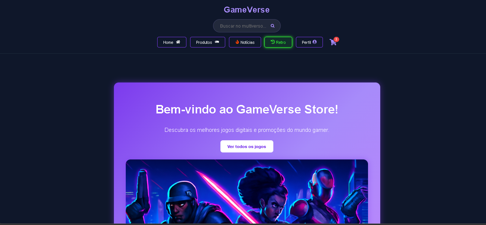
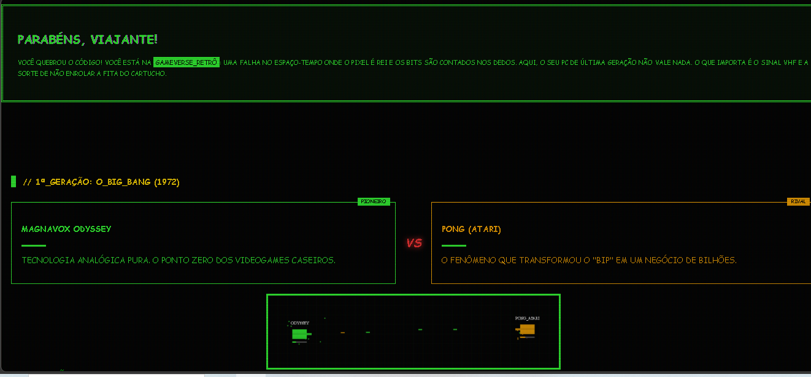

# 🌌 GameVerse Store & GameVerse Retrô 🕹️


Bem-vindo ao **GameVerse Store**, um projeto front-end desenvolvido em React que vai muito além de um simples e-commerce de jogos digitais. O que começa como uma loja moderna e elegante esconde um segredo nostálgico: um universo retrô completo ativado por *Easter Egg*, com direito a emulador de clássicos direto no navegador, sistema de conquistas duplo e animações em Canvas.

> ⚠️ **Aviso Importante:** Toda a parte de E-Commerce deste site é **totalmente ilustrativa**. Não há processamento real de compras ou transações financeiras. Este é um projeto sem fins lucrativos, desenvolvido estritamente para fins de aprendizado, ganho de experiência e como Projeto de Conclusão de Curso da Geração Tech!

---

## 📸 Sneak Peek

### O Mundo Moderno (GameVerse Store)
> Uma interface limpa, focada na experiência do usuário para descoberta de jogos atuais e notícias do mundo gamer.



### A Falha na Matrix (GameVerse Retrô)
> Ativado via código secreto ou botão especial, o site se transforma em um terminal CRT verde e preto, com história dos consoles e jogos clássicos totalmente jogáveis.



---

## 🚀 Funcionalidades

O projeto é dividido em dois ecossistemas independentes que coexistem na mesma aplicação:

### 🟣 GameVerse Store (A Loja Moderna)
- **Catálogo de Produtos:** Exploração de jogos modernos com detalhes, preços (ilustrativos) e imagens.
- **Sistema de Notícias:** Feed dinâmico de atualizações do mundo gamer.
- **Perfil do Usuário & Conquistas:** Dashboard moderno com estatísticas, nível do jogador e um **sistema de conquistas dedicado**. Ações na loja (como ler notícias ou explorar jogos) geram XP e desbloqueiam troféus no perfil principal.
- **Context API State:** Gerenciamento global de status e XP (`AchievementContext` e `statsContext`).
- **Design Responsivo:** UI/UX focada em neon, dark mode nativo e componentes fluidos.

### 🟢 GameVerse Retrô (O Submundo)
- **Acesso Secreto:** Desbloqueado através de um Hook customizado (`useKonamiCode`).
- **História Interativa:** Duelos de consoles clássicos (ex: Magnavox Odyssey vs Atari) renderizados com animações dinâmicas em `<canvas>`.
- **Emulador Nativo:** Jogue clássicos de NES, SNES, Mega Drive, GBA, GBC, SMS e até PS1 diretamente em um modal interativo no navegador!
- **Trophy Room (Conquistas Retrô):** Um segundo sistema de achievements, totalmente isolado. Usa o `LocalStorage` para registrar jogos clássicos que você abriu/zerou, sem bagunçar as conquistas da loja moderna.
- **Hall da Fama:** Um ranking nostálgico dos melhores jogadores.
- **Estética CRT:** CSS robusto simulando monitores de tubo antigos, scanlines e fontes pixeladas.

---

## 📂 Estrutura do Projeto

A arquitetura foi pensada para separar a lógica moderna da retrô, mantendo o código organizado:

```text
📦 src
 ┣ 📂 assets       # Imagens, ícones globais
 ┣ 📂 components   # Componentes isolados
 ┃ ┣ 📜 BannerSlider.jsx       # Moderno
 ┃ ┣ 📜 EmulatorModal.jsx      # Retrô (Janela de jogo)
 ┃ ┣ 📜 ConsoleDuelCanvas.jsx  # Retrô (Animações de consoles)
 ┃ ┗ 📜 ...
 ┣ 📂 context      # Gerenciadores de estado (Achievements, Stats)
 ┣ 📂 data         # "Banco de dados" local (jogos, consoles, detalhes)
 ┣ 📂 hooks        # Hooks customizados (ex: useKonamiCode)
 ┣ 📂 pages        # Rotas da aplicação (Home, Products, RetroGames, etc)
 ┗ 📜 App.jsx      # Roteamento principal e Providers
 
📦 public
 ┗ 📂 assets
    ┣ 📂 emulator  # BIOS para o núcleo do emulador rodar os jogos
    ┣ 📂 games     # Capas dos jogos clássicos
    ┗ 📂 roms      # Arquivos .lib / ROMs organizados por console (gba, snes, etc)
````
🛠️ Como rodar o projeto localmente
```bash
    git clone https://github.com/EllonMagno88/gameverse-store1.git #Clone o Repositório
    cd gameverse-store #Acesse a pasta do projeto
    npm install #Instale as Dependências
    npm run dev #Inicialize o servidor de desenvolvimento Vite
    http://localhost:5173. #Acesse pelo navegador através desse link
````

💡 Dica: Tente usar o Konami Code no teclado para descobrir a magia!

## Links Alternativos

Netlify: https://gameverse-store.netlify.app/

## 🧠 Aprendizados e Desafios
Integração de Emulação Front-end: Lidar com a leitura de ROMs e arquivos de BIOS (.lib) usando JavaScript para rodar jogos de diferentes gerações no mesmo <EmulatorModal />.

Separação de Estados (Context API vs LocalStorage): Resolver conflitos de ciclo de vida do React ao gerenciar dois sistemas de conquistas separados (Moderno e Retrô). A solução foi isolar os troféus modernos no Context API e fazer o Perfil Retrô ler o progresso diretamente do LocalStorage.

Manipulação de Canvas: Criar animações de duelo de consoles de forma performática sem depender de bibliotecas pesadas de animação de terceiros.

Feito com ☕ e 👾 por Ellon Magno
